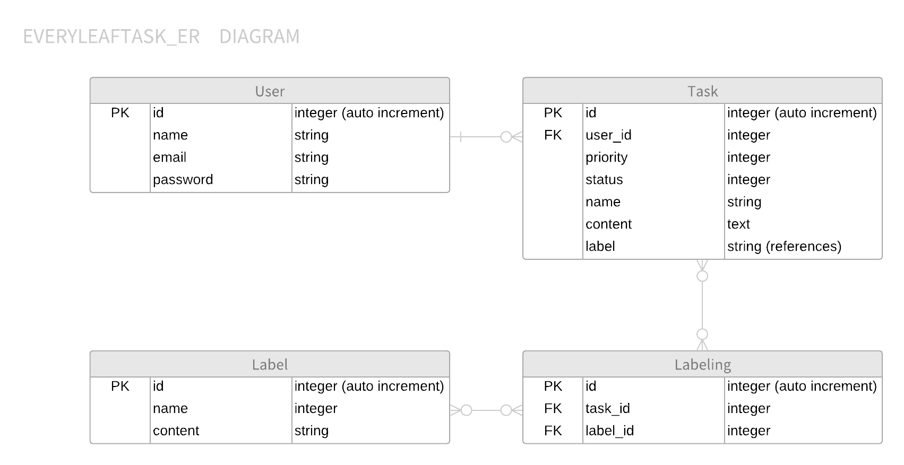

# Task Management App
## OverView
タスクマネジメント用のアプリケーション  
***

## Requirement
- Ruby 2.6.2
- Ruby on Rails 5.2.3
- PostgreSQL 11.2

***
## Table Schema
  
***
## How to Deploy
1. git add -A
2. git commit -m "コミットメッセージを記載"
3. git push origin master  
  =>git hubへのpush により自動でherokuへdeployされる
***
